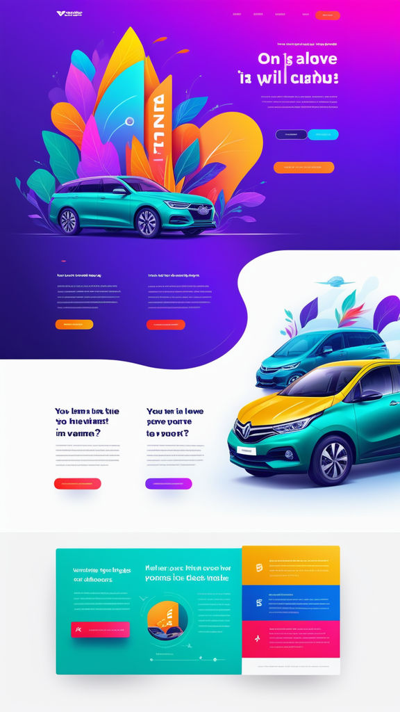

# SORTEIO DE UM MAZDA

## Descrição do projeto

- Landing Page fictícia anunciando um sorteio futuro de um Mazda MX-5 Miata.

## Funcionalidades pretendidas

- Formulário para inscrição no sorteio;
- Usuário recebe e-mail confirmando estar inscrito;
- Chatbot integrado para tirar dúvidas sobre o sorteio.

## Tecnologias 

### Front-end

- React
- Typescript
- Tailwind
- Vite

### Back-end

## Objetivos do projeto

1) Continuar meus aprendizados em front-end;
2) Praticar um novo padrão de layoyt, com curvas como divisórias entre seções;
3) Aprender a integrar um chatbot na página;
4) Continuar aprimorando minhas capacidades de transformar um modelo abstrato de página em algo palpável, atraente e comercialmente efetivo.

## Recursos:

### Inspiração visual:

- Imagem produzida por AI (playground.com)

### Fontes

h1 - Oxygen
h2 ... h6, a - Questrial
p - Roboto

### Copy da Página

1) Header:

a - logo
b - Inicio
c - Sobre
d - Como Participar
e - Invreva-se

2) Hero

h1 - Já pensou, você de Mazda?
h2 - Neste verão, a Motor City coloca um dos carros mais desejados de 2024 a sorteio. Não fique fora dessa, quem sabe você é o sortudo da vez?
button - Quero Participar!
button2 - Quero Saber Mais.

3) Sobre

flexbox

coluna  1

h3 - Mazda? De graça?

p - A fim de comemorar o aniversário de 30 anos da rede de concessionárias que mais cresce no Brasil, a Motor City decidiu presentear você! E para fazer essa festa, escolhemos sortear um dos modelos mais cobiçados do mundo no momento. O aniversário é nosso, mas o presente é todo seu!

button - Quero ver o Mazda em Ação

coluna 2

h3 - Um festival de presentes

p - O sorteio é nossa forma de agradecer ao carinho e colaboração de nosso clientes, mas não é nosso único presente. Durante o nosso mês de comemorações, estaremos oferecendo ofertas incríveis. Confira nosso preços, converse com nossos atendentes sobre oportunidades de financiamento, e garanta já a motorização da sua vida.

button - Ir para Página da Motor City

4) Como Participar?

flexbox

coluna 1

h3 - Quero participar. Como faço?

p - Mais fácil, só bicicleta de rodinha: bata preencher seus dados no formulário abaixo e aguardar o e-mail de confirmação. O e-mail conterá seu número de sorteio, com o qual você estará concorrendo ao prêmio.

button - Preencher Formulário

h3 - Como descubro quem ganhou?

p - Faremos uma live, no dia 28/11, às 19h. Não deixe de conferir nosso show de ofertas, nossas brincadeiras e uma demonstração ao vivo do Mazda sendo conduzido pelo piloto de Rally, Giacov Gianone. 

button - Página da Live

5) Formulário

a - Nome Completo
b - Endereço
c - E-mail
d - Qual a rede de concessionárias que mais cresce no Brasil?

submit

6) Assistente Virtual (position: fixed, fora do layout)

h4 - Dúvidas? Converse com Nosso Assistente Virtual!

7) Footer